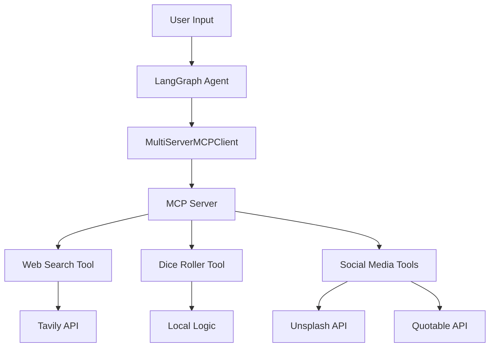

# 🔄 LangGraph + MCP Integration

This document explains how to use your MCP server with LangGraph agents, enabling powerful AI workflows that can interact with your custom tools.

## 🎯 What This Enables

Your LangGraph agent can now:
- 🎲 **Roll dice** using natural language
- 🔍 **Search the web** for real-time information  
- 🎨 **Create social media posts** with images and text
- 🖼️ **Find presentation images** for slides
- 💬 **Generate quote cards** for inspiration

## 🚀 Quick Start

### 1. Setup Environment

```bash
# Copy environment template
cp .env.sample .env

# Edit .env and add your API keys:
# OPENAI_API_KEY=your_openai_key_here
# TAVILY_API_KEY=your_tavily_key_here
# UNSPLASH_ACCESS_KEY=your_unsplash_key_here (optional)
```

### 2. Run Examples

```bash
# Run the example script
uv run python example_langgraph_usage.py

# Or run the main agent demo
uv run python langgraph_agent.py
```

## 📝 Code Examples

### Basic Usage

```python
from langgraph_agent import MCPLangGraphAgent

# Create and initialize agent
agent = MCPLangGraphAgent()
await agent.initialize()

# Use natural language to invoke MCP tools
result = await agent.chat("Roll 2d20 and create a social media post about the results")
```

### Advanced StateGraph Usage

```python
# Use StateGraph for complex workflows
result = await agent.chat_with_state_graph(
    "Search for AI news, create a LinkedIn post about it, and get a slide image"
)
```

### Multiple Tool Coordination

The agent automatically coordinates multiple tools:

```python
# This will:
# 1. Search web for AI news (web_search tool)
# 2. Create social post (create_social_post tool)  
# 3. Find relevant image (get_slide_image tool)
await agent.chat(
    "Find recent AI breakthroughs and create a professional social media campaign"
)
```

## 🛠️ Architecture

### How It Works



### Components

1. **MCPLangGraphAgent**: Main agent class that connects LangGraph to MCP
2. **MultiServerMCPClient**: Handles communication with MCP servers
3. **ReAct Agent**: Uses reasoning and acting to solve problems
4. **StateGraph**: More complex workflow management
5. **MCP Tools**: Your custom tools (dice, web search, content creation)

## 🎮 Interactive Examples

### Example 1: Content Creation Workflow
```
User: "Create a motivational post about AI and include a dice roll for fun"

Agent Process:
1. Rolls dice using roll_dice tool
2. Creates social post using create_social_post tool  
3. Combines results into engaging content
```

### Example 2: Research & Presentation
```
User: "Research machine learning trends and prepare a slide"

Agent Process:
1. Searches web using web_search tool
2. Finds presentation image using get_slide_image tool
3. Summarizes findings for presentation
```

### Example 3: Inspiration Generation
```
User: "I need motivation for my startup"

Agent Process:
1. Creates quote card using create_quote_card tool
2. Generates custom inspirational content
3. Provides actionable motivation
```

## 🔧 Configuration Options

### MCP Server Configuration

```python
# Custom server configuration
mcp_config = {
    "my-server": {
        "command": "uv",
        "args": ["--directory", "/path/to/project", "run", "server.py"],
        "transport": "stdio",
    }
}
```

### Language Model Options

```python
# Different OpenAI models
agent = MCPLangGraphAgent()
agent.llm = ChatOpenAI(
    model="gpt-4",           # More powerful
    # model="gpt-4o-mini",   # Cost efficient (default)
    temperature=0.7,         # Creativity level
)
```

## 📊 Available Tools

| Tool | Description | Example Usage |
|------|-------------|---------------|
| `web_search` | Search the web via Tavily | "What's the latest in AI?" |
| `roll_dice` | Roll dice with D&D notation | "Roll 3d6 for character stats" |
| `create_social_post` | Generate social media content | "Create a LinkedIn post about Python" |
| `get_slide_image` | Find presentation images | "Get images for machine learning slides" |
| `create_quote_card` | Generate inspirational quotes | "Make a quote card about innovation" |

## 🎯 Use Cases

### 🎲 Gaming & Entertainment
- Generate character stats with dice rolls
- Create social posts about gaming sessions
- Find fantasy-themed images for campaigns

### 📈 Business & Marketing  
- Research industry trends
- Create professional social media content
- Generate presentation materials
- Find motivational quotes for teams

### 🎓 Education & Training
- Create educational content with images
- Generate quiz questions with dice randomization
- Research topics and create summaries
- Motivational content for students

### 💼 Content Creation
- Automated social media campaigns
- Blog post research and imagery
- Quote cards for inspiration
- Presentation slide generation

## 🔍 Troubleshooting

### Common Issues

**Error: "OpenAI API key not found"**
```bash
# Solution: Set your OpenAI API key
echo "OPENAI_API_KEY=your_key_here" >> .env
```

**Error: "MCP server connection failed"**
```bash
# Solution: Check server.py is working
uv run python server.py
```

**Error: "No tools loaded"**
```bash
# Solution: Ensure MCP server tools are properly decorated
# Check server.py has @mcp.tool() decorators
```

## 🚀 Advanced Usage

### Custom Tool Integration

```python
# Add your own MCP tools to server.py
@mcp.tool()
def my_custom_tool(param: str) -> str:
    """Description of what your tool does"""
    return f"Processed: {param}"

# Agent will automatically detect and use new tools
```

### Workflow Customization

```python
# Create custom StateGraph workflows
from langgraph.graph import StateGraph, MessagesState

def custom_workflow():
    builder = StateGraph(MessagesState)
    # Add your custom nodes and edges
    return builder.compile()
```

## 📚 Next Steps

1. **Explore Examples**: Run `example_langgraph_usage.py` to see all capabilities
2. **Add Custom Tools**: Extend `server.py` with your own MCP tools
3. **Create Workflows**: Build complex StateGraph workflows for your use cases
4. **Deploy**: Consider deploying with LangGraph API server for production

## 🤝 Integration with Other Systems

This setup follows the patterns from the [langchain-mcp-adapters](https://github.com/langchain-ai/langchain-mcp-adapters) repository, making it compatible with:

- **LangGraph API Server**: Deploy as production service
- **Multiple MCP Servers**: Connect to multiple tool sources
- **Streamable HTTP**: Use HTTP transport for web deployment
- **Custom Headers**: Add authentication and custom headers

Ready to build amazing AI workflows? Start with `example_langgraph_usage.py`! 🎉
