# 🚀 MCP Server App

## <h1 align="center">Complete MCP Server with LangGraph Agent Integration</h1>

This project demonstrates a comprehensive **Model Context Protocol (MCP) server** with **LangGraph agent integration**, showcasing how to build powerful AI workflows that can interact with custom tools and external APIs.

## 🔄 Architecture Overview

```mermaid
graph TD
    subgraph "🚀 MCP Server App Architecture"
        subgraph "Client Layer"
            A["🤖 LangGraph Agent<br/>ChatOpenAI + ReAct"] 
            B["💻 Interactive Examples<br/>Quick Demo Mode"]
            C["🧪 Pytest Test Suite<br/>8 Comprehensive Tests"]
        end
        
        subgraph "MCP Integration"
            D["🔌 MultiServerMCPClient<br/>langchain-mcp-adapters"]
            E["📡 STDIO Transport<br/>Process Communication"]
        end
        
        subgraph "Server Layer"
            F["⚡ FastMCP Server<br/>Python MCP Framework"]
            G["🎲 Dice Roller<br/>Custom Notation Parser"]
            H["🔍 Web Search<br/>Tavily API Integration"]
            I["📱 Social Creator<br/>Unsplash + Quotable APIs"]
            M["🐙 GitHub Tools<br/>Repository & File Access"]
        end
        
        subgraph "External APIs"
            J["🌐 Tavily Search API<br/>Real-time Web Data"]
            K["📸 Unsplash API<br/>High-Quality Images"]
            L["💭 Quotable API<br/>Inspirational Quotes"]
            N["🔗 GitHub API<br/>Public Repository Data"]
        end
    end
    
    %% Connections
    A --> D
    B --> D
    C --> F
    D --> E
    E --> F
    F --> G
    F --> H
    F --> I
    F --> M
    H --> J
    I --> K
    I --> L
    M --> N
    
    %% Styling
    classDef clientStyle fill:#e1f5fe,stroke:#01579b,stroke-width:2px,color:#000
    classDef mcpStyle fill:#f3e5f5,stroke:#4a148c,stroke-width:2px,color:#000
    classDef serverStyle fill:#e8f5e8,stroke:#1b5e20,stroke-width:2px,color:#000
    classDef apiStyle fill:#fff3e0,stroke:#e65100,stroke-width:2px,color:#000
    
    class A,B,C clientStyle
    class D,E mcpStyle
    class F,G,H,I,M serverStyle
    class J,K,L,N apiStyle
```



### Architecture Components

1. **MCPLangGraphAgent**: Main agent class that connects LangGraph to MCP
2. **MultiServerMCPClient**: Handles communication with MCP servers
3. **ReAct Agent**: Uses reasoning and acting to solve problems
4. **StateGraph**: More complex workflow management
5. **MCP Tools**: Your custom tools (dice, web search, content creation)

## 🎯 What This Project Enables

Your AI agents can now:
- 🎲 **Roll dice** using natural language and D&D notation
- 🔍 **Search the web** for real-time information via Tavily API
- 🎨 **Create social media posts** with images and inspirational text
- 🖼️ **Find presentation images** for slides and presentations
- 💬 **Generate quote cards** with backgrounds and motivational content
- 🐙 **Search GitHub repositories** by query with detailed information
- 📁 **Browse GitHub files** and get repository contents
- 📄 **Read GitHub files** directly from any public repository

## 🏗️ Project Structure

```
AIE7-MCP-Session/
├── 📁 server/                 # MCP Server Components
│   ├── __init__.py           # Server module initialization
│   ├── main.py              # Main MCP server entry point
│   ├── dice_roller.py       # Dice rolling tool implementation
│   ├── dice_roller_numpy.py # NumPy-based dice roller variant
│   ├── social_content_creator.py # Social media content creation tools
│   └── github_tool.py       # GitHub API integration tools
│
├── 📁 client/                # Client Components  
│   ├── __init__.py          # Client module initialization
│   └── langgraph_agent.py   # LangGraph agent implementation
│
├── 📁 tests/                 # Test Files
│   ├── __init__.py          # Tests module initialization
│   ├── test_server.py       # Basic MCP server tests
│   └── test_mcp_integration.py # Integration tests
│
├── 📁 examples/              # Usage Examples
│   ├── __init__.py          # Examples module initialization
│   └── example_langgraph_usage.py # LangGraph usage examples
│
├── 📄 run_server.py         # Convenient server entry point
├── 📄 run_client.py         # Convenient client entry point
├── 📄 pyproject.toml        # Project dependencies
├── 📄 .env.sample           # Environment variables template
└── 📄 README.md             # This documentation
```

## 🚀 Quick Start Guide

### Prerequisites
- **Python 3.13+** 
- **OpenAI API Key** (required for LangGraph agent)
- **Tavily API Key** (required for web search)
- **Unsplash API Key** (optional - falls back to Lorem Picsum)
- **GitHub Token** (optional - enables private repository access)

### Installation Steps

**1. Clone & Setup**
```bash
git clone <repository-url>
cd AIE7-MCP-Session
cp .env.sample .env
```

**2. Configure API Keys**
Edit `.env` file:
```bash
OPENAI_API_KEY=your_openai_key_here     # Required
TAVILY_API_KEY=your_tavily_key_here     # Required  
UNSPLASH_ACCESS_KEY=your_key_here       # Optional
GITHUB_TOKEN=ghp_your_token_here        # Optional
```

**3. Install Dependencies**
```bash
uv sync    # Recommended
# OR: pip install -r requirements.txt
```

**4. Verify Installation**
```bash
uv run tests/test_mcp_integration.py    # Test components
uv run run_client.py                    # Interactive demo
uv run run_server.py                    # Test server
```

## 🛠️ Available Tools

| Tool | Description | Example Usage |
|------|-------------|---------------|
| `web_search` | Search the web via Tavily API | "What's the latest in AI?" |
| `roll_dice` | Roll dice with D&D notation | "Roll 3d6 for character stats" |
| `create_social_post` | Generate social media content | "Create a LinkedIn post about Python" |
| `get_slide_image` | Find presentation images | "Get images for machine learning slides" |
| `create_quote_card` | Generate inspirational quotes | "Make a quote card about innovation" |

## 📝 Usage Examples

### Basic MCP Server Usage

```bash
# Start the MCP server
uv run run_server.py

# In another terminal, test with a simple client
uv run tests/test_server.py
```

### LangGraph Agent Integration

#### Step-by-Step Demo

**1. Start the Interactive Client**
```bash
uv run run_client.py
```

**2. Choose Demo Mode**
```
🚀 LangGraph + MCP Integration Examples
Choose what to run:
1. Quick Examples        # Automated demonstrations
2. Interactive Mode      # Chat with the agent
3. Compare ReAct vs StateGraph  # See different agent patterns

Enter choice (1-3): 1
```

**3. Watch the Agent Work**
The agent will automatically demonstrate:
- Rolling dice with natural language
- Searching the web for current information
- Creating social media posts with images
- Finding presentation-ready images
- Generating inspirational quote cards

#### Code Examples

**Basic Usage:**
```python
from client.langgraph_agent import MCPLangGraphAgent

# Create and initialize agent
agent = MCPLangGraphAgent()
await agent.initialize()

# Simple tool usage
result = await agent.chat("Roll 2d20")

# Multi-tool coordination
result = await agent.chat("Roll 2d20 and create a social media post about the results")
```

**Advanced Workflows:**
```python
# Complex multi-tool coordination
result = await agent.chat(
    "Search for AI news, create a LinkedIn post about it, and get a slide image"
)

# StateGraph for complex workflows
result = await agent.chat_with_state_graph(
    "Research machine learning trends and prepare presentation materials"
)
```

## 📡 STDIO Transport Communication

Our MCP Server App uses **STDIO transport** for seamless process-to-process communication between the LangGraph agent and FastMCP server.

### 🔧 **1. Server Side - FastMCP Server**
**Files: `server/main.py` and `run_server.py`**
```python
# server/main.py (line 48)
if __name__ == "__main__":
    mcp.run(transport="stdio")

# run_server.py (line 20)
main.mcp.run(transport="stdio")
```
- The **FastMCP server** runs with STDIO transport
- This means it communicates via **standard input/output** rather than HTTP
- Perfect for process-to-process communication

### 🔌 **2. Client Side - MCP Configuration**
**File: `client/langgraph_agent.py` (lines 55-61)**
```python
self.mcp_config = {
    "my-mcp-server": {
        "command": "uv",
        "args": ["--directory", current_dir, "run", "run_server.py"],
        "transport": "stdio",  # ← STDIO specified here
    }
}
```
- The **MultiServerMCPClient** is configured to use STDIO transport
- It spawns the server process (`uv run run_server.py`)
- Communicates via **stdin/stdout pipes**

### 🌊 **3. How STDIO Transport Works**

```
┌─────────────────┐    STDIO     ┌─────────────────┐
│  LangGraph      │◄────────────►│   FastMCP       │
│  Agent          │   (pipes)    │   Server        │
│  (Client)       │              │   (Process)     │
└─────────────────┘              └─────────────────┘
```

**Process:**
1. **Client** (LangGraph agent) starts the **server process** 
2. **STDIO pipes** connect the two processes
3. **JSON-RPC messages** flow over stdin/stdout
4. Server responds to tool calls via the same pipes

### 🎯 **Why STDIO?**
- **Process isolation**: Server runs in separate process
- **Clean communication**: No network ports or HTTP servers needed
- **MCP standard**: Official MCP protocol transport method
- **Development friendly**: Easy to debug and test locally

The STDIO transport is the backbone that enables our LangGraph agent to seamlessly communicate with the FastMCP server!

## 🔧 Configuration

### Environment Variables

Create a `.env` file with the following:

```bash
# REQUIRED: OpenAI API Key for LangGraph agent
OPENAI_API_KEY=your_openai_api_key_here

# REQUIRED: Tavily API Key for web search functionality
TAVILY_API_KEY=your_tavily_api_key_here

# OPTIONAL: Unsplash API Key for high-quality images
# If not provided, the system will use Lorem Picsum as fallback
UNSPLASH_ACCESS_KEY=your_unsplash_access_key_here

# OPTIONAL: GitHub Personal Access Token for private repository access
# Create at: https://github.com/settings/tokens
# Scopes needed: repo (for private repos), public_repo (for public repos)
GITHUB_TOKEN=ghp_your_github_personal_access_token_here

# OPTIONAL: LangChain API Key for LangSmith tracing/monitoring
# Only needed if you want to use LangSmith for debugging/monitoring
LANGCHAIN_API_KEY=your_langchain_api_key_here
```

### 🔐 GitHub Token Setup (Optional)

To access your **private repositories**, create a GitHub Personal Access Token:

1. **Go to**: https://github.com/settings/tokens
2. **Click**: "Generate new token" → "Generate new token (classic)"
3. **Set scopes**:
   - ✅ `repo` (for private repositories)
   - ✅ `public_repo` (for public repositories)
4. **Copy token** and add to `.env`:
   ```bash
   GITHUB_TOKEN=ghp_your_personal_access_token_here
   ```

**Without a token**: Only public repositories are accessible  
**With a token**: Full access to your private and public repositories

### MCP Configuration for Cursor

To use this MCP server with Cursor, add to your `~/.cursor/mcp.json`:

```json
{
  "mcpServers": {
    "mcp-server": {
      "command": "uv",
      "args": ["--directory", "/absolute/path/to/AIE7-MCP-Session", "run", "run_server.py"]
    }
  }
}
```

## 🎮 Interactive Examples & Workflows

### Workflow 1: Content Creation
**Input:** "Create a motivational post about AI and include a dice roll for fun"

**Agent Process:**
1. 🎲 Rolls dice using `roll_dice` tool
2. 🎨 Creates social post using `create_social_post` tool  
3. 🔄 Combines results into engaging content

**Expected Output:**
```
🎲 Rolled: 18 (excellent!)
📱 Social Post: "Feeling lucky today! Just rolled an 18 - time to tackle that AI project! 
Innovation distinguishes between a leader and a follower. - Steve Jobs
#AI #motivation #lucky18"
```

### Workflow 2: Research & Presentation
**Input:** "Research machine learning trends and prepare a slide"

**Agent Process:**
1. 🔍 Searches web using `web_search` tool
2. 🖼️ Finds presentation image using `get_slide_image` tool
3. 📊 Summarizes findings for presentation

### Workflow 3: Inspiration Generation  
**Input:** "I need motivation for my startup"

**Agent Process:**
1. 💬 Creates quote card using `create_quote_card` tool
2. 🎨 Generates custom inspirational content
3. 🎯 Provides actionable motivation

## 🧪 Testing

### Run All Tests with Pytest

```bash
# Run all tests (recommended)
uv run pytest tests/ -v

# Run specific test file
uv run pytest tests/test_server.py -v
uv run pytest tests/test_mcp_integration.py -v

# Run specific test method
uv run pytest tests/test_server.py::TestMCPServer::test_dice_rolling_tool -v

# Run with coverage (if available)
uv run pytest tests/ --cov=server --cov-report=term-missing
```

### Test Coverage
Our comprehensive test suite includes:
- **7 tests** in `test_server.py` - Server functionality, tool registration, and GitHub tools
- **3 tests** in `test_mcp_integration.py` - LangGraph integration tests  
- **Total: 10 tests** covering MCP server, tools, GitHub API integration, and client integration

### Manual Testing

```bash
# Test server startup
uv run run_server.py

# Test client integration
uv run run_client.py

# Test specific functionality
uv run examples/example_langgraph_usage.py

# Legacy test execution (backwards compatible)
uv run tests/test_server.py
```

## 🛠️ Development

### Adding New Server Tools

1. Implement your tool in the `server/` directory
2. Register the tool in `server/main.py` using `@mcp.tool()` decorator
3. Add tests in `tests/`
4. Update documentation

Example:
```python
@mcp.tool()
def my_custom_tool(param: str) -> str:
    """Description of what your tool does"""
    return f"Processed: {param}"
```

### Adding New Client Features

1. Implement features in the `client/` directory
2. Add examples in `examples/`
3. Add integration tests in `tests/`
4. Update documentation

### Entry Points

```bash
# Server entry points
uv run server/main.py          # Direct server execution
uv run run_server.py           # Convenient wrapper

# Client entry points  
uv run examples/example_langgraph_usage.py  # Direct examples
uv run run_client.py           # Convenient wrapper

# Testing entry points
uv run tests/test_mcp_integration.py        # Integration tests
pytest tests/                               # All tests
```

## 🎮 Live Demo Walkthrough

### Quick 5-Minute Demo

**Step 1: Setup (1 minute)**
```bash
# Clone and setup
git clone <repository-url>
cd AIE7-MCP-Session
cp .env.sample .env
# Add your OPENAI_API_KEY and TAVILY_API_KEY to .env
```

**Step 2: Install Dependencies (1 minute)**
```bash
uv sync
```

**Step 3: Test MCP Server (1 minute)**
```bash
# Test server works
uv run run_server.py &
sleep 2
pkill -f run_server.py
echo "✅ Server working!"
```

**Step 4: Run Interactive Demo (2 minutes)**
```bash
uv run run_client.py
# Choose option 1 for automated examples
# Watch the agent coordinate multiple tools
```

### Expected Demo Output

```
🎯 Quick LangGraph + MCP Examples
🔹 Testing: Roll a d20 for me and tell me what it means for my luck today
🔌 Connecting to MCP server...
✅ Connected! Loaded 5 tools
🤖 Agent: You rolled a 19 on a d20! That's excellent luck - great success awaits!

🔹 Testing: Search for recent AI news and create a professional social media post
🤖 Agent: Here's a professional LinkedIn post about recent AI developments:
💡 Reflecting on Recent AI Developments...
[Generated post with image and hashtags]
```

## 🎯 Use Cases

### 🎲 Gaming & Entertainment
- Generate character stats with dice rolls
- Create social posts about gaming sessions
- Find fantasy-themed images for campaigns

### 📈 Business & Marketing  
- Research industry trends
- Create professional social media content
- Generate presentation materials
- Find motivational quotes for teams

### 🎓 Education & Training
- Create educational content with images
- Generate quiz questions with dice randomization
- Research topics and create summaries
- Motivational content for students

### 💼 Content Creation
- Automated social media campaigns
- Blog post research and imagery
- Quote cards for inspiration

### 🐙 Developer Workflow
- Search GitHub repositories for inspiration
- Browse repository files and structure
- Read documentation and code examples
- Analyze open-source project patterns
- Presentation slide generation

## 🔍 Troubleshooting

### Common Issues

**Error: "OpenAI API key not found"**
```bash
# Solution: Set your OpenAI API key
echo "OPENAI_API_KEY=your_key_here" >> .env
```

**Error: "MCP server connection failed"**
```bash
# Solution: Check server is working
uv run run_server.py
```

**Error: "No tools loaded"**
```bash
# Solution: Ensure MCP server tools are properly decorated
# Check server/main.py has @mcp.tool() decorators
```

**Cursor MCP Issues:**
1. Restart Cursor after updating `mcp.json`
2. Check Cursor's Developer Tools → Console for MCP errors
3. Ensure absolute paths in MCP configuration
4. Verify `.env` file has required API keys

## 🚀 Advanced Usage

### Custom Tool Integration

```python
# Add your own MCP tools to server/main.py
@mcp.tool()
def my_custom_tool(param: str) -> str:
    """Description of what your tool does"""
    return f"Processed: {param}"

# Agent will automatically detect and use new tools
```

### Workflow Customization

```python
# Create custom StateGraph workflows
from langgraph.graph import StateGraph, MessagesState

def custom_workflow():
    builder = StateGraph(MessagesState)
    # Add your custom nodes and edges
    return builder.compile()
```

### Language Model Options

```python
# Different OpenAI models
agent = MCPLangGraphAgent()
agent.llm = ChatOpenAI(
    model="gpt-4",           # More powerful
    # model="gpt-4o-mini",   # Cost efficient (default)
    temperature=0.7,         # Creativity level
)
```

## 🤝 Integration with Other Systems

This setup follows the patterns from the [langchain-mcp-adapters](https://github.com/langchain-ai/langchain-mcp-adapters) repository, making it compatible with:

- **LangGraph API Server**: Deploy as production service
- **Multiple MCP Servers**: Connect to multiple tool sources
- **Streamable HTTP**: Use HTTP transport for web deployment
- **Custom Headers**: Add authentication and custom headers

## 📈 Benefits of This Architecture

### ✅ **Clear Separation of Concerns**
- Server logic isolated from client logic
- Tests separated from implementation
- Examples clearly organized

### ✅ **Easy Development**
- Add new tools without affecting client code
- Test components independently
- Clear import paths and dependencies

### ✅ **Production Ready**
- Server can be deployed independently
- Client can connect to remote servers
- Scalable architecture for multiple clients

### ✅ **Maintainable**
- Logical file organization
- Clear entry points for different use cases
- Comprehensive testing structure

## 📚 Next Steps

1. **Explore Examples**: Run `uv run run_client.py` to see all capabilities
2. **Add Custom Tools**: Extend `server/main.py` with your own MCP tools
3. **Create Workflows**: Build complex StateGraph workflows for your use cases
4. **Deploy**: Consider deploying with LangGraph API server for production
5. **Integrate**: Use with Cursor or other MCP-compatible AI assistants

## 📄 License

MIT License - see LICENSE file for details.

## 🤝 Contributing

Contributions are welcome! Please read the contributing guidelines and submit pull requests for any improvements.

---

**Ready to build amazing AI workflows?** Start with `uv run run_client.py` and explore the interactive examples! 🎉